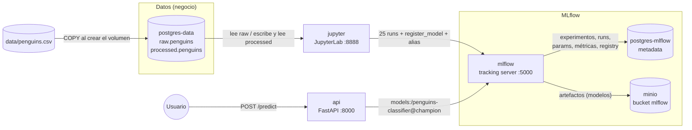

# Taller 4 — MLflow: experimentación, registro de modelos e inferencia

**Curso:** Operaciones de Machine Learning (MLOps), Pontificia Universidad Javeriana
**Stack:** Docker Compose · MLflow 3.16 · PostgreSQL 16 (×2) · MinIO (Silo) · JupyterLab · FastAPI · scikit-learn · `uv`
**Dataset:** Palmer Penguins (clasificación de especie: Adelie, Chinstrap, Gentoo)

Con un único `docker compose up`, este taller levanta un entorno de experimentación completo:

- los datos viven en una base de datos (crudos y procesados);
- desde un notebook se entrenan **25 configuraciones** de un modelo, y todas quedan registradas en MLflow con sus parámetros, métricas y artefactos;
- el mejor modelo se registra en el **Model Registry** de MLflow con el alias `champion`;
- una API de inferencia toma ese modelo **desde MLflow** y responde predicciones.

Este documento explica la arquitectura, cómo levantar y usar el entorno, las decisiones de diseño y los resultados. Cada contenedor tiene además su propio README con el detalle ([sección 10](#10-documentación-por-componente)).

---

## Tabla de contenido

1. [Enunciado y cumplimiento](#1-enunciado-y-cumplimiento)
2. [Arquitectura](#2-arquitectura)
3. [Estructura del repositorio](#3-estructura-del-repositorio)
4. [Cómo levantar el entorno](#4-cómo-levantar-el-entorno)
5. [Flujo de trabajo de punta a punta](#5-flujo-de-trabajo-de-punta-a-punta)
6. [Decisiones de diseño](#6-decisiones-de-diseño)
7. [Resultados de la experimentación](#7-resultados-de-la-experimentación)
8. [Dificultades y errores encontrados](#8-dificultades-y-errores-encontrados)
9. [Limitaciones y trabajo futuro](#9-limitaciones-y-trabajo-futuro)
10. [Documentación por componente](#10-documentación-por-componente)
11. [Lista de imágenes](#11-lista-de-imágenes)

---

## 1. Enunciado y cumplimiento

| # | Requisito del enunciado | Cómo se cumple | Dónde |
|---|---|---|---|
| 1 | Instancia de una base de datos dedicada a la metadata de MLflow | `postgres-mlflow`: solo la usa el servidor de MLflow (experimentos, runs, Model Registry) | [postgres-mlflow/](postgres-mlflow/README.md) |
| 2 | Instancia de MLflow | `mlflow`: tracking server 3.16.1 instalado con `uv` | [mlflow/](mlflow/README.md) |
| 3 | Instancia de MinIO dedicada a MLflow | `minio` + `minio-init`: bucket `mlflow`, artifact store del servidor | [minio/](minio/README.md) |
| 4 | Instancia de JupyterLab | `jupyter`: JupyterLab instalado con `uv` | [jupyter/](jupyter/README.md) |
| 5 | Notebook con al menos 20 ejecuciones variando hiperparámetros, todo registrado en MLflow | Grilla de 5 × 5 = **25 configuraciones** de RandomForest, cada una un run con params, 4 métricas y el modelo | [experimentos_mlflow.ipynb](jupyter/notebooks/experimentos_mlflow.ipynb) |
| 6 | Datos en una base de datos, procesados también en base de datos, distinta a la de MLflow | `postgres-data`: esquema `raw` (344 filas) y `processed` (333 filas) | [postgres-init/](postgres-init/README.md) |
| 7 | Modelos registrados en MLflow | `penguins-classifier` versión 1, alias `@champion` | Notebook, sección 7 |
| 8 | API de inferencia que toma el modelo desde MLflow | `api`: FastAPI carga `penguins-classifier@champion` desde el Model Registry | [api/](api/README.md) |

Todos los servicios están en el mismo [`docker-compose.yaml`](docker-compose.yaml).

> 📸 **Imagen pendiente:** `docs/img/01-docker-compose-ps.png` — salida de `docker compose ps` con todos los servicios `healthy` y `minio-init` en `Exited (0)`.

<!--  -->

---

## 2. Arquitectura



Hay **tres flujos** que conviene distinguir:

1. **Datos.** El CSV crudo se carga en `postgres-data` (`raw.penguins`) al crear el volumen. El notebook lo lee, lo limpia y escribe `processed.penguins`; luego entrena leyendo **desde la base de datos**, no desde el CSV.
2. **Experimentos y modelos.** El notebook solo habla con el servidor de MLflow (`http://mlflow:5000`). El servidor guarda la metadata en `postgres-mlflow` y los artefactos en MinIO. El notebook **no conoce las credenciales de MinIO**: el servidor hace de proxy (`--serve-artifacts`).
3. **Inferencia.** La API pregunta a MLflow a qué versión apunta el alias `champion`, descarga ese modelo (a través del mismo proxy) y lo mantiene en memoria.

**Dos bases de datos separadas, a propósito.** `postgres-mlflow` es de la herramienta y `postgres-data` es del negocio. Así se pueden respaldar, escalar o reiniciar por separado, y un cambio en el esquema de datos nunca toca la metadata de MLflow. Es el mismo criterio que en taller003 y proyecto1 con Airflow.

**Red interna y puertos del host.** Dentro de la red de Docker los servicios se llaman por su nombre (`mlflow:5000`, `minio:9000`, `postgres-data:5432`). Desde el navegador se usan los puertos publicados en el host, configurables en `.env` (sección 4). Por eso el notebook usa `http://mlflow:5000`, mientras que en el navegador se abre `http://localhost:5000` (o el puerto que se haya configurado).

---

## 3. Estructura del repositorio

```
taller004/
├── README.md                    # este documento
├── docker-compose.yaml          # los 7 servicios (6 permanentes + minio-init)
├── .env.example                 # variables: credenciales, puertos, modelo a servir
├── pyproject.toml / uv.lock     # entorno LOCAL de desarrollo (IDE); no se despliega
├── .python-version              # 3.11
├── data/
│   └── penguins.csv             # fuente cruda (344 filas)
├── postgres-init/               # → postgres-data
│   ├── README.md
│   └── 01-raw.sql               # esquemas raw/processed + carga del CSV
├── postgres-mlflow/
│   └── README.md                # → postgres-mlflow (solo imagen oficial, sin archivos propios)
├── minio/
│   └── README.md                # → minio + minio-init (solo imagen, sin archivos propios)
├── mlflow/                      # → mlflow
│   ├── README.md
│   ├── Dockerfile
│   └── pyproject.toml / uv.lock
├── jupyter/                     # → jupyter
│   ├── README.md
│   ├── Dockerfile
│   ├── pyproject.toml / uv.lock
│   └── notebooks/
│       └── experimentos_mlflow.ipynb
├── api/                         # → api
│   ├── README.md
│   ├── Dockerfile
│   ├── pyproject.toml / uv.lock
│   └── app/
│       ├── main.py              # endpoints
│       ├── model_loader.py      # carga desde el Model Registry
│       └── schemas.py           # contrato de entrada/salida
└── docs/
    └── img/                     # capturas de pantalla (sección 11)
```

**`uv` en todo el proyecto.** Cada servicio que se construye (`mlflow/`, `jupyter/`, `api/`) tiene su propio `pyproject.toml` y `uv.lock`. Su `Dockerfile` instala exactamente lo bloqueado con `uv sync --frozen` y arranca con `uv run --no-sync`. El `pyproject.toml` de la raíz es solo un entorno local para el IDE (autocompletado); **ningún contenedor lo usa**.

---

## 4. Cómo levantar el entorno

### Requisitos

- Docker y Docker Compose v2.
- Puertos libres en el host (configurables): 5000, 8000, 8888, 9000 y 9001.

### Configuración

```bash
cd taller004
cp .env.example .env
```

El `.env` no se sube al repositorio (está en `.gitignore`). Las variables más relevantes:

| Variable | Valor por defecto | Para qué |
|---|---|---|
| `MLFLOW_HOST_PORT` | `5000` | Puerto de la UI de MLflow en el host. **En macOS usar `5001`**: el 5000 lo ocupa AirPlay Receiver |
| `API_HOST_PORT`, `MINIO_API_HOST_PORT`, `MINIO_CONSOLE_HOST_PORT`, `JUPYTER_HOST_PORT` | `8000`, `9000`, `9001`, `8888` | Cambiarlos si chocan con otro stack (por ejemplo proyecto1, que usa 8000, 9000 y 9001) |
| `MLFLOW_ALLOWED_HOSTS` | `mlflow,mlflow:5000,localhost,...` | Hosts que acepta el servidor de MLflow (sección 6.6) |
| `MODEL_NAME`, `MODEL_ALIAS` | `penguins-classifier`, `champion` | Qué modelo registra el notebook y cuál sirve la API |
| `JUPYTER_TOKEN` | `devtoken` | Token de acceso a JupyterLab |

### Arranque

```bash
docker compose up -d --build
docker compose ps        # todos "healthy"; minio-init "Exited (0)"
```

El orden de arranque lo controlan los `depends_on` con `condition`: MLflow espera a su Postgres y a que exista el bucket; Jupyter y la API esperan a que MLflow responda en `/health`.

### URLs

| Servicio | URL | Acceso |
|---|---|---|
| MLflow | http://localhost:5000 | — |
| JupyterLab | http://localhost:8888 | token `devtoken` |
| API (Swagger) | http://localhost:8000/docs | — |
| Consola de MinIO | http://localhost:9001 | `MINIO_ROOT_USER` / `MINIO_ROOT_PASSWORD` |

### Uso

1. Abrir JupyterLab y ejecutar `experimentos_mlflow.ipynb` de principio a fin (**Run → Run All Cells**). Crea las tablas procesadas, los 25 runs y registra el modelo.
2. Revisar el experimento `penguinsTaller004` y el modelo `penguins-classifier` en la UI de MLflow.
3. Probar la API:

```bash
curl -s localhost:8000/health

curl -s -X POST localhost:8000/predict -H "Content-Type: application/json" -d '{
  "island": "Torgersen", "bill_length_mm": 39.1, "bill_depth_mm": 18.7,
  "flipper_length_mm": 181, "body_mass_g": 3750, "sex": "male"}'
```

Si la API arrancó antes de que existiera el modelo registrado, no hace falta reiniciarla: el siguiente `/predict` lo carga solo (o se puede forzar con `POST /reload`).

### Apagar

```bash
docker compose down        # conserva datos, runs, modelos y artefactos (volúmenes)
docker compose down -v     # ⚠️ BORRA todo: datos, experimentos, Model Registry y bucket
```

---

## 5. Flujo de trabajo de punta a punta

| Paso | Dónde | Qué ocurre | Resultado |
|---|---|---|---|
| 1 | `postgres-init/01-raw.sql` | Al crear el volumen, crea los esquemas y copia el CSV a `raw.penguins` sin limpiar | 344 filas (11 con faltantes) |
| 2 | Notebook §1 | Lee `raw.penguins` | — |
| 3 | Notebook §2 | Selecciona columnas, elimina filas con faltantes y escribe `processed.penguins` | 333 filas |
| 4 | Notebook §3 | Lee `processed.penguins` desde la BD y separa train/test estratificado (80/20) | 266 / 67 filas |
| 5 | Notebook §4 | Conecta con MLflow y fija el experimento `penguinsTaller004` | — |
| 6 | Notebook §5 | `train_and_log(params, run_name)`: entrena el pipeline, calcula métricas en test y con validación cruzada, y registra todo en un run | 1 run |
| 7 | Notebook §6 | Recorre la grilla de 25 combinaciones | 25 runs |
| 8 | Notebook §7 | Busca el mejor run con `search_runs`, lo registra con `register_model` y le asigna el alias `champion` | `penguins-classifier` v1 `@champion` |
| 9 | Notebook §8 | Carga `models:/penguins-classifier@champion` como lo hará la API y predice | Verificación |
| 10 | API | `/predict` consulta el alias, carga la versión correspondiente y predice | `{"species": "Adelie", ...}` |

> 📸 **Imagen pendiente:** `docs/img/02-jupyter-notebook.png` — JupyterLab con el notebook abierto, idealmente en la celda de la grilla mostrando el avance de los runs.

<!--  -->

---

## 6. Decisiones de diseño

### 6.1 El preprocesamiento categórico va dentro del modelo

`processed.penguins` guarda `island` y `sex` **como texto**. El one-hot encoding se hace dentro de un `Pipeline` de sklearn (`ColumnTransformer` + `OneHotEncoder` + `RandomForestClassifier`), y es ese pipeline completo el que se registra en MLflow.

- **Ventaja:** la API le pasa al modelo los mismos seis campos que recibe en el JSON. No hay que replicar el preprocesamiento en la API, así que entrenamiento y servicio no pueden desincronizarse.
- **Alternativa descartada:** guardar en `processed` las columnas ya codificadas (`island_Biscoe`, `island_Dream`…), como en taller002. Obligaba a duplicar la lógica de codificación en la API.

### 6.2 Se compara con validación cruzada, no con el test

El conjunto de test tiene solo 67 filas y el dataset es muy separable: **6 de las 25 configuraciones sacan accuracy 1.0 en test**, incluidas algunas claramente peores en validación cruzada. Por eso cada run registra, además de `accuracy` y `f1_macro` en test, `cv_f1_macro_mean` y `cv_f1_macro_std` con `StratifiedKFold` de 5 folds sobre el train.

- La CV se hace sobre el **pipeline completo**, así que el encoder se reajusta en cada fold y no hay fuga de información.
- Se usa **F1 macro** porque las clases están desbalanceadas (146 / 119 / 68).
- El test queda como confirmación final, no como criterio de selección.

### 6.3 La grilla cubre un rango amplio a propósito

`n_estimators ∈ {1, 5, 20, 100, 300}` × `max_depth ∈ {1, 2, 4, 8, None}`. Se incluyen valores deliberadamente pobres (1 árbol, profundidad 1) para que la experimentación **muestre el efecto** de cada hiperparámetro. Con solo valores "razonables", todos los runs habrían quedado en torno a 0.97 y la comparación no habría enseñado nada.

### 6.4 Criterio de selección y desempate

1. Mayor `cv_f1_macro_mean`.
2. A igual media, menor `cv_f1_macro_std` (el modelo más estable entre folds).
3. Si persiste el empate, **el modelo más simple**: menos árboles y profundidad acotada.

Hubo un empate de 4 configuraciones en 0.9909 ± 0.0112, y se eligió **`n_estimators=100, max_depth=8`**: mismo rendimiento que con 300 árboles (3 veces más pesado) y que con profundidad ilimitada (más propenso a sobreajustar si crecen los datos). El criterio queda escrito en código, con un `filter_string` en `search_runs`, para que la selección sea reproducible.

### 6.5 La API sigue un alias, pero carga por número de versión

- La API se configura con `MODEL_NAME` y `MODEL_ALIAS`, nunca con un número de versión. Para promover un modelo nuevo basta mover el alias `champion` en MLflow; la API lo detecta en la siguiente petición, **sin redeploy**.
- Al cargar, la API resuelve el alias a una versión concreta y descarga `models:/penguins-classifier/<versión>`. Así, la versión que reporta en la respuesta siempre es exactamente la que cargó, aunque alguien mueva el alias en medio.
- Consultar el alias es barato; descargar el modelo no. Por eso solo se descarga cuando la versión cambia (caché + `threading.Lock`, el mismo patrón que proyecto1).

### 6.6 MLflow sirve los artefactos como proxy

El servidor arranca con `--serve-artifacts --artifacts-destination s3://mlflow`. Los clientes (notebook y API) guardan y leen artefactos a través de `mlflow-artifacts:/...`, y es el servidor el que habla con MinIO.

- **Ventaja:** las credenciales de MinIO solo las tiene el servidor de MLflow. Jupyter y la API solo necesitan `MLFLOW_TRACKING_URI`.
- **Alternativa descartada:** que cada cliente escriba directo a S3 (`--default-artifact-root s3://...`), lo que obliga a repartir las credenciales y a instalar `boto3` en todos los contenedores.

MLflow 3.x además valida el header `Host` de cada petición para prevenir ataques de DNS rebinding. Por defecto solo acepta `localhost` e IPs privadas, así que las peticiones de los otros contenedores a `http://mlflow:5000` eran rechazadas. `--allowed-hosts` (desde `MLFLOW_ALLOWED_HOSTS`) declara explícitamente los nombres válidos.

### 6.7 Serialización segura con skops

MLflow 3.16 guarda los modelos de sklearn con **skops** en lugar de pickle. Cargar un pickle ejecuta código arbitrario; skops solo reconstruye tipos de una lista de confianza. El tipo `sklearn.tree._tree.Tree` (la estructura interna de cada árbol del bosque) no está en esa lista por defecto, así que se declara de forma explícita con `skops_trusted_types=["sklearn.tree._tree.Tree"]` al registrar el modelo.

- Se declara **solo ese tipo**, el único que se revisó y que viene del propio entrenamiento.
- La lista queda guardada en el archivo `MLmodel`, así que la API la aplica al cargar sin declararla de nuevo.
- **Alternativa descartada:** volver a pickle (`serialization_format="cloudpickle"`), que desactiva la protección para todo el modelo.

### 6.8 Mismas versiones en entrenamiento y servicio

`mlflow==3.16.1`, `scikit-learn==1.9.1`, `pandas==3.0.6` y `numpy==2.4.6` están fijadas con `==` tanto en `jupyter/` como en `api/`. Un modelo serializado con una versión de sklearn no está garantizado en otra (lección de proyecto1). Al cargar, MLflow compara las dependencias del modelo con el entorno y avisa si difieren.

### 6.9 Imagen de MinIO: Silo

MinIO dejó de publicar imágenes oficiales, así que se usa **Silo** (`pgsty/silo`), un fork mantenido con el mismo código, protocolo S3 y variables `MINIO_*`. Es la misma decisión que en proyecto1, con un tag fijo y no `:latest`.

---

## 7. Resultados de la experimentación

Las 25 configuraciones, ordenadas con el criterio de la sección 6.4:

| n_estimators | max_depth | accuracy (test) | F1 macro (test) | F1 macro CV (media) | F1 macro CV (desv.) |
|---:|:---:|---:|---:|---:|---:|
| **100** | **8** | **1.0000** | **1.0000** | **0.9909** | **0.0112** |
| 100 | None | 1.0000 | 1.0000 | 0.9909 | 0.0112 |
| 300 | 8 | 1.0000 | 1.0000 | 0.9909 | 0.0112 |
| 300 | None | 1.0000 | 1.0000 | 0.9909 | 0.0112 |
| 5 | 8 | 0.9104 | 0.9081 | 0.9867 | 0.0109 |
| 20 | 8 | 0.9851 | 0.9873 | 0.9833 | 0.0087 |
| 20 | None | 0.9851 | 0.9873 | 0.9833 | 0.0087 |
| 5 | None | 0.9104 | 0.9081 | 0.9833 | 0.0087 |
| 20 | 4 | 0.9851 | 0.9873 | 0.9787 | 0.0144 |
| 5 | 4 | 0.9701 | 0.9744 | 0.9733 | 0.0081 |
| 100 | 4 | 1.0000 | 1.0000 | 0.9717 | 0.0240 |
| 300 | 2 | 0.9851 | 0.9820 | 0.9717 | 0.0240 |
| 300 | 4 | 1.0000 | 1.0000 | 0.9717 | 0.0240 |
| 100 | 2 | 0.9851 | 0.9820 | 0.9673 | 0.0202 |
| 20 | 2 | 0.9851 | 0.9820 | 0.9653 | 0.0206 |
| 1 | 8 | 0.9254 | 0.9201 | 0.9595 | 0.0301 |
| 1 | None | 0.9254 | 0.9201 | 0.9595 | 0.0301 |
| 5 | 2 | 0.9552 | 0.9474 | 0.9514 | 0.0256 |
| 1 | 4 | 0.9254 | 0.9201 | 0.9496 | 0.0373 |
| 1 | 2 | 0.9254 | 0.9271 | 0.9152 | 0.0363 |
| 100 | 1 | 0.7910 | 0.6019 | 0.5973 | 0.0074 |
| 300 | 1 | 0.7910 | 0.6019 | 0.5973 | 0.0074 |
| 20 | 1 | 0.7761 | 0.5911 | 0.5943 | 0.0092 |
| 5 | 1 | 0.7612 | 0.5801 | 0.5943 | 0.0092 |
| 1 | 1 | 0.6269 | 0.4679 | 0.5038 | 0.0379 |

En negrita, el modelo registrado como `penguins-classifier` v1 `@champion`.

### Lo que muestra la experimentación

- **`max_depth` es el hiperparámetro dominante.** Con profundidad 1, todos los modelos quedan en torno a 0.60 de F1 en CV, tengan 1 o 300 árboles: un árbol de una sola pregunta no puede separar tres especies. Con profundidad 4 u 8 se supera 0.97.
- **`max_depth=8` y `None` dan resultados idénticos.** Con 266 filas de entrenamiento, los árboles terminan de separar las clases antes de llegar a profundidad 8, así que "sin límite" equivale a 8.
- **Más de 100 árboles no aporta.** 100 y 300 dan exactamente las mismas métricas.
- **Más árboles reducen la variabilidad.** Con profundidad 4, la desviación de la CV baja de 0.037 (1 árbol) a 0.008 (5 árboles): el promedio de árboles distintos estabiliza el modelo.
- **El test engaña en ambas direcciones.** `n=5, d=8` saca 0.908 en test pero 0.987 en CV; `n=100, d=4` saca 1.0 en test pero 0.972 en CV. Esto justifica seleccionar por CV (sección 6.2).

> 📸 **Imagen pendiente:** `docs/img/03-mlflow-runs.png` — tabla de runs del experimento `penguinsTaller004` en MLflow, con las columnas de parámetros y métricas visibles.

<!--  -->

> 📸 **Imagen pendiente:** `docs/img/04-mlflow-compare.png` — vista **Compare** de los 25 runs (gráfico de coordenadas paralelas `n_estimators` / `max_depth` → `cv_f1_macro_mean`).

<!--  -->

> 📸 **Imagen pendiente:** `docs/img/05-mlflow-run-detalle.png` — detalle del run elegido (`rf-n100-d8`): parámetros y las 4 métricas.

<!--  -->

> 📸 **Imagen pendiente:** `docs/img/06-mlflow-run-artifacts.png` — pestaña *Artifacts* del run elegido, con `MLmodel`, `model.skops`, `requirements.txt`, etc.

<!--  -->

> 📸 **Imagen pendiente:** `docs/img/07-mlflow-model-registry.png` — *Model registry*: `penguins-classifier`, versión 1 con alias `@champion`.

<!--  -->

> 📸 **Imagen pendiente:** `docs/img/08-minio-bucket.png` — consola de MinIO, bucket `mlflow`, carpeta `1/models/m-.../artifacts/` con los archivos del modelo.

<!--  -->

> 📸 **Imagen pendiente:** `docs/img/09-api-predict.png` — Swagger de la API (`/docs`) con una respuesta exitosa de `POST /predict`.

<!--  -->

---

## 8. Dificultades y errores encontrados

Esta sección recoge los problemas que aparecieron durante el taller, tanto al montar la infraestructura como al escribir el notebook y la API, con su causa y cómo se resolvieron. Algunos errores de desarrollo se vieron al ejecutar; otros se detectaron al revisar el código antes de correrlo. Varios no rompían nada de forma visible: el código se habría ejecutado, pero haciendo algo distinto de lo que se pretendía. Por eso se documentan junto con la lección que dejaron.

### 8.1 Infraestructura

| Síntoma | Causa | Solución |
|---|---|---|
| El servidor de MLflow no arrancaba: `ModuleNotFoundError: No module named 'psycopg'` | SQLAlchemy 2.1 (que trae MLflow 3.16) cambió el driver por defecto de `postgresql://` a psycopg v3, que no está instalado | URI explícita `postgresql+psycopg2://` en `--backend-store-uri` |
| Las peticiones de Jupyter y la API a `http://mlflow:5000` eran rechazadas | MLflow 3.x valida el header `Host` y por defecto solo acepta `localhost` e IPs privadas | `--allowed-hosts` con los nombres de la red de Docker (`MLFLOW_ALLOWED_HOSTS`) |
| El puerto 5000 ya estaba en uso en macOS | AirPlay Receiver escucha en el 5000 | Puerto del host configurable: `MLFLOW_HOST_PORT=5001` |
| `minio-init` fallaba con `lookup minio ... no such host` | El puerto 9000 lo ocupaba el MinIO de proyecto1, que seguía corriendo. Docker no pudo publicar el puerto y dejó el contenedor `minio` **sin red**: aparecía como "running", pero nadie lo encontraba por nombre | Todos los puertos del host parametrizados en `.env` (19000, 19001 y 18000 en la máquina de desarrollo) |
| `docker compose logs api` respondía `no such service: api` y avisos de `AIRFLOW_UID` | Se ejecutó desde la carpeta padre. `docker compose` sube por los directorios buscando un compose y encontró otro archivo, de Airflow, en la carpeta personal | Ejecutar siempre desde `taller004/` (o con `-f taller004/docker-compose.yaml`) |
| El MLflow Assistant de la UI responde *"only accessible from the same host"* | El asistente solo funciona si el navegador corre en la misma máquina que el servidor, y aquí el servidor está en un contenedor | No se usa: no es necesario para el taller |

**Lección:** cuando un contenedor no encuentra a otro por nombre, revisar sus redes (`docker inspect <contenedor> --format '{{json .NetworkSettings.Networks}}'`). Si salen vacías, la causa más común es un conflicto de puertos.

### 8.2 Entorno de trabajo

| Síntoma | Causa | Solución |
|---|---|---|
| `pip install mlfow` → `No matching distribution found` | Error de tipeo (`mlfow`), y además se ejecutó con otro entorno virtual activo (`machLearn`) en lugar del de `taller004` | No hacía falta instalar nada: `uv sync` instala `mlflow` con la versión fijada. Para agregar paquetes se usa `uv add`, no `pip` |
| El notebook falla al abrirlo con un kernel local en VS Code | El notebook usa variables de entorno y hostnames (`mlflow`, `postgres-data`) que solo existen dentro de la red de Docker | Ejecutarlo en JupyterLab (dentro del contenedor); el entorno local con `uv` solo sirve para autocompletado |
| Se quería `ipykernel` en local sin que llegara a Docker | — | El `pyproject.toml` de la raíz nunca entra a ninguna imagen; además se puede declarar como dependencia de desarrollo (`uv add --dev ipykernel`) |

### 8.3 Notebook: configuración de MLflow

| Error | Causa | Solución |
|---|---|---|
| La celda mostraba `<function mlflow...set_experiment(...)>` y no creaba el experimento | Se escribió la función sin paréntesis: Python la referencia pero no la ejecuta | `mlflow.set_experiment(EXPERIMENT_NAME)` |
| Los runs aparecían en el experimento 1 y no en el 2, que era el esperado | Se crearon dos experimentos con nombres casi iguales, `penguinsTaller004` y `penguins-Taller004`, al cambiar el nombre entre ejecuciones | Nombre definido una sola vez en la constante `EXPERIMENT_NAME`; el experimento sobrante se borró |
| Tras reiniciar el kernel, los runs se guardaban en otro experimento | No se volvió a ejecutar la celda de configuración | Después de reiniciar: **Run All Above Selected Cell** |
| Los enlaces que imprime MLflow (`http://mlflow:5000/#/...`) no abren en el navegador | MLflow arma los enlaces con la URI del notebook, que es un nombre de la red interna de Docker | Desde el host usar `localhost:<MLFLOW_HOST_PORT>` |

**Lección:** en MLflow, un nombre de experimento mal escrito no da error, crea uno nuevo en silencio. Además, un experimento borrado deja su nombre reservado hasta purgarlo con `mlflow gc`.

### 8.4 Notebook: entrenamiento y registro de runs

| Error | Causa | Solución |
|---|---|---|
| `cross_val_score(pipeline, X_test, y_pred, ...)` | Se validaba con los datos de test (que deben usarse una sola vez, al final) y contra las **predicciones** del modelo en lugar de las etiquetas reales: el modelo se habría evaluado contra sí mismo | `cross_val_score(pipeline, X_train, y_train, ...)` |
| `AttributeError: 'numpy.ndarray' object has no attribute 'stdev'` (y luego `pstdev`) | `stdev` y `pstdev` son del módulo `statistics` de Python; numpy usa otro nombre | `cv_scores.std()` |
| `mlflow.log_param(pipeline)` y `mlflow.log_metric()(metrics)` | Se usó la versión singular (una clave y un valor), se pasó el objeto modelo en vez del diccionario de hiperparámetros, y había un par de paréntesis de más | `mlflow.log_params(params)` y `mlflow.log_metrics(metrics)` |
| `infer_signature(preprocess, pipeline)` y `log_model(sk_model=metrics)` | Se pasaron objetos (el transformador, el modelo, el diccionario de métricas) donde van datos, y viceversa | `infer_signature(X_train, pipeline.predict(X_train))` y `sk_model=pipeline` |
| `UntrustedTypesFoundException: sklearn.tree._tree.Tree` al guardar el modelo | MLflow 3.16 serializa con skops, que no confía por defecto en la estructura interna de los árboles | `skops_trusted_types=["sklearn.tree._tree.Tree"]` (sección 6.7) |
| `skops_trusted_types=[sklearn.tree._tree.Tree]` daba `NameError` | Faltaban las comillas: skops espera **nombres** de tipos (strings), no las clases | `["sklearn.tree._tree.Tree"]` |
| Al convertir el bloque en función, el cuerpo del `with` quedó sin sangría (`IndentationError`) | El contenido del `with` necesita un nivel más de sangría | Indentar todo el cuerpo dentro del `with` |
| `mlflow.start_run(run_name)` | El primer argumento posicional de `start_run` es `run_id`, no `run_name`: MLflow habría intentado reanudar un run inexistente | `mlflow.start_run(run_name=run_name)` |
| La función devolvía el nombre del run en vez de su identificador | `return run_name, metrics` | `with mlflow.start_run(...) as run:` y `return run.info.run_id, metrics`. Los nombres se pueden repetir; el id es único |
| Avisos `Failed to resolve installed pip version` | `uv` no instala `pip`, y MLflow lo busca para escribir `conda.yaml` | Inofensivo: `requirements.txt` no se ve afectado |

**Lección:** pasar los argumentos con nombre (`run_name=...`, `sk_model=...`) evita la mayoría de estos errores, y cuando no se recuerda un método, `objeto.` + **Tab** en Jupyter lista los disponibles.

### 8.5 Notebook: la grilla de experimentación

| Error | Causa | Solución |
|---|---|---|
| El modelo de prueba sacaba accuracy y F1 de 1.0 en test | El dataset es muy separable y el test tiene solo 67 filas: con 1.0 en muchos modelos no habría forma de elegir | Se agregó validación cruzada como métrica de selección (sección 6.2) |
| La grilla habría generado diccionarios con las listas completas: `{"n_estimators": [1, 2, 3, 4, 5], ...}`, que `RandomForestClassifier` rechaza | En la comprensión de lista se usaron `N_ESTIMATORS` y `MAX_DEPTH` en lugar de las variables `n`, `d` de cada vuelta | `{"n_estimators": n, "max_depth": d}` |
| La primera grilla tenía 15 combinaciones con valores solo pequeños (1 a 5 árboles) | 5 × 3 no llega al mínimo de 20, y sin valores grandes no se ve el efecto de los hiperparámetros | Grilla de 5 × 5 = 25 con un rango amplio (sección 6.3) |
| Todos los runs se llamaban igual | `run_name = "rf-n50-d3"` fijo | f-string con los parámetros: `f"rf-n{...}-d{...}"` |
| `results.metrics` y `sort_values(results)` | `results` es una lista; las métricas del run actual están en `metrics`, y `sort_values` espera nombres de columna | `metrics["cv_f1_macro_mean"]` y `sort_values(["cv_f1_macro_mean", "cv_f1_macro_std"], ...)` |
| El experimento terminó con 102 runs en lugar de 25 | La celda de la grilla se ejecutó varias veces y cada ejecución crea runs nuevos (con los mismos nombres e ids distintos) | Separar en celdas distintas la grilla, el loop y el análisis; limpiar los duplicados desde la UI |

### 8.6 Notebook: selección y registro del modelo

| Error | Causa | Solución |
|---|---|---|
| `search_runs(experiment_names=[df_results.run_name], order_by=[df_results.accuracy, ...])` | Se pasaron columnas de pandas a una función que consulta el servidor y espera **texto** | `experiment_names=[EXPERIMENT_NAME]` y `order_by=["metrics.cv_f1_macro_mean DESC", ...]` |
| `order_by=["metrics.accuracy ACE", "params.n_estimators DEC"]` | `ACE` y `DEC` no existen; las palabras válidas son `ASC` y `DESC` | `ASC` / `DESC` |
| Ordenar por `accuracy` podía elegir un modelo peor | 6 configuraciones empatan en 1.0 de test, incluida `n=100, d=4`, con CV 0.972 frente a 0.991 | Ordenar por la misma métrica con la que se compararon los modelos: `cv_f1_macro_mean` |
| `order_by` con `params.n_estimators` no ordena por número | Los params se guardan como texto y se ordenan alfabéticamente: `"100" < "20" < "5"` | Desempatar con `filter_string` en lugar de ordenar por params |
| `"params.cv_f1_macro_std ASC"` no desempataba, **sin dar error** | `cv_f1_macro_std` es una métrica: con el prefijo `params.` MLflow ordenaba por un campo inexistente y lo ignoraba en silencio | `"metrics.cv_f1_macro_std ASC"` |
| `search_runs` devolvía 4 runs `rf-n100-d8` con ids distintos | Consecuencia de las ejecuciones repetidas de la grilla | Elegir de forma determinista: `order_by=["attributes.start_time DESC"]`, `max_results=1` |
| `register_model("runs:/<id>/best_run_name")` → `Unable to find a logged_model with artifact_path best_run_name` | La segunda parte de la URI es la carpeta del modelo dentro del run (el `name` de `log_model`), no el nombre del run. Además iba como texto literal, sin llaves | `runs:/{best_run_id}/model` |
| `register_model` avisó *"no artifacts at artifact path 'model'"* | En MLflow 3 el modelo es una entidad propia (*logged model*, `m-...`) y sus archivos no viven bajo el run | No requiere cambios: MLflow resuelve el logged model vinculado al run |
| `set_registered_model_alias(..., version=model_version.name)` | Se pasó el nombre del modelo (`penguins-classifier`) donde va el número de versión | `version=model_version.version` |

**Lección:** el error más peligroso fue el de `params.cv_f1_macro_std`, porque no fallaba: el resultado *parecía* correcto. Revisar las salidas con `max_results` mayor que 1 permitió detectar tanto ese error como el empate y los runs duplicados.

### 8.7 API

| Error | Causa | Solución |
|---|---|---|
| Los logs repetían el mismo error después de "corregir" | El archivo `model_loader.py` no se había guardado; sin cambios en disco, `--reload` no reinicia nada | Guardar y confirmar en los logs `StatReload detected changes ... Reloading` |
| `get_model_version() got an unexpected keyword argument 'model_name'` (y luego `'alias'`) | Se usó `get_model_version`, que busca por **número** de versión, en lugar de `get_model_version_by_alias` | `get_model_version_by_alias(name=MODEL_NAME, alias=MODEL_ALIAS)` |
| `INVALID_PARAMETER_VALUE: Registered model alias 1 not found` | URI `models:/penguins-classifier@1`: en una URI de MLflow lo que va tras `@` es siempre un alias | Cargar por número con barra: `models:/penguins-classifier/1` |
| `mv._lastest_version` | Se confundió el método propio de la clase (`_latest_version`) con un atributo del objeto de MLflow, además del error de tipeo | `mv.version` |
| Aviso `psutil (current: uninstalled, required: psutil==7.2.2)` al cargar el modelo | MLflow infiere los requirements del entorno de Jupyter, donde `psutil` existe porque lo trae JupyterLab | Inofensivo: el modelo no lo usa, y las librerías que sí importan coinciden (sección 6.8) |

**Lección:** el log de la API se leyó completo en cada paso. Dos veces el mensaje empezaba igual ("No se pudo cargar un modelo") pero la causa era otra, y solo el final del mensaje lo mostraba.

---

## 9. Limitaciones y trabajo futuro

- **Dataset pequeño.** Con 333 filas, cada fold de validación tiene unas 53 y un solo error mueve el F1 casi 2 puntos. La CV mitiga, pero no elimina, el ruido de la evaluación.
- **Los datos crudos se cargan una sola vez**, al crear el volumen de `postgres-data`. Para recargarlos hace falta `docker compose down -v`, que borra también MLflow. Una tarea de ingesta separada (por ejemplo un DAG de Airflow, como en taller003) lo resolvería.
- **Promoción manual.** El alias `champion` se asigna desde el notebook. Un paso siguiente sería promover automáticamente solo si el nuevo modelo supera al actual en CV.
- **Sin autenticación.** MLflow, MinIO y la API no tienen control de acceso más allá de las credenciales de desarrollo de `.env`.
- **Una consulta a MLflow por petición.** La API pregunta por el alias en cada `/predict`. Es barato, pero con mucho tráfico convendría consultarlo cada N segundos.
- **Re-ejecuciones duplican runs.** Volver a ejecutar la cewlda de la grilla crea 25 runs nuevos con los mismos nombres. Un tag por "tanda" (o borrar la anterior) ayudaría a mantener el experimento ordenado.

---

## 10. Documentación por componente

| Contenedor | README | Qué explica |
|---|---|---|
| `postgres-mlflow` | [postgres-mlflow/README.md](postgres-mlflow/README.md) | La base de metadata de MLflow y qué guarda |
| `postgres-data` | [postgres-init/README.md](postgres-init/README.md) | Esquemas `raw`/`processed` y la carga inicial del CSV |
| `minio`, `minio-init` | [minio/README.md](minio/README.md) | El artifact store, el bucket y cómo se organizan los archivos |
| `mlflow` | [mlflow/README.md](mlflow/README.md) | El tracking server, el proxy de artefactos y la seguridad |
| `jupyter` | [jupyter/README.md](jupyter/README.md) | El entorno y el notebook sección por sección |
| `api` | [api/README.md](api/README.md) | Endpoints, contrato y cómo se carga el modelo |

---

## 11. Lista de imágenes

Guardar las capturas en `docs/img/` con estos nombres. Después, en cada bloque "📸 Imagen pendiente" de los READMEs, borrar la cita y quitar el `<!-- -->` de la línea de la imagen.

| Archivo | Qué capturar | Se usa en |
|---|---|---|
| `01-docker-compose-ps.png` | `docker compose ps`: servicios `healthy`, `minio-init` en `Exited (0)` | README general §1 |
| `02-jupyter-notebook.png` | JupyterLab con el notebook abierto | README general §5, jupyter |
| `03-mlflow-runs.png` | Tabla de runs del experimento con params y métricas | README general §7, mlflow |
| `04-mlflow-compare.png` | Vista *Compare* de los 25 runs | README general §7, mlflow |
| `05-mlflow-run-detalle.png` | Run `rf-n100-d8`: params y métricas | README general §7, jupyter |
| `06-mlflow-run-artifacts.png` | Pestaña *Artifacts* del run elegido | README general §7, mlflow |
| `07-mlflow-model-registry.png` | `penguins-classifier` v1 `@champion` | README general §7, mlflow |
| `08-minio-bucket.png` | Consola de MinIO, bucket `mlflow` con los archivos del modelo | README general §7, minio |
| `09-api-predict.png` | Swagger con respuesta de `POST /predict` | README general §7, api |
| `10-api-health.png` | Respuesta de `GET /health` con `model_loaded: true` | api |
| `11-postgres-data-tablas.png` | Consulta a `raw.penguins` y `processed.penguins` (conteos) | postgres-init |
| `12-postgres-mlflow-tablas.png` | Consulta a las tablas `experiments` / `runs` / `model_versions` | postgres-mlflow |
